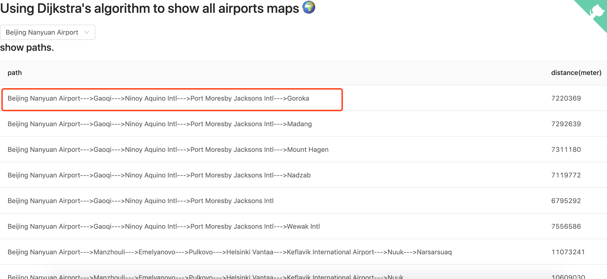
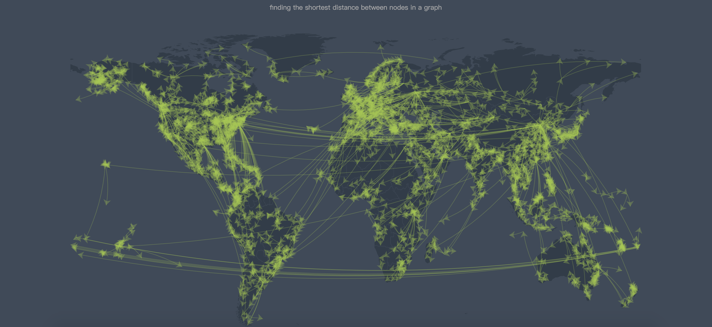

# flights
使用 Dijkstra 算法（找寻最短航行路线）显示航线地图🌍。

<h2><a href="http://106.15.231.221:8101/" target="_blank">演示地址</a></h2>

### 项目说明
1. 数据来源 [data.dat](https://openflights.org/data.html)
2. 通过经纬度计算每两个机场之间的距离
3. 使用 Dijkstra's 算法计算从单点到其余飞机场的最短距离
4. 使用 echarts 画航线图

### 项目展示

其中图1显示从北京机场到世界各个机场的最短航线；图2是根据所有最短航线画出的地图，均已实现💪。

图一

图二


### 启动服务和测试
```
# 安装依赖
$ npm install 

# 前端打包
$ npm run pack

# 启动dev模式
$ npm run start:dev

# 启动生产模式
$ npm run start:pro

```
<h2> 感觉不错，欢迎 star，谢谢。<h2>

